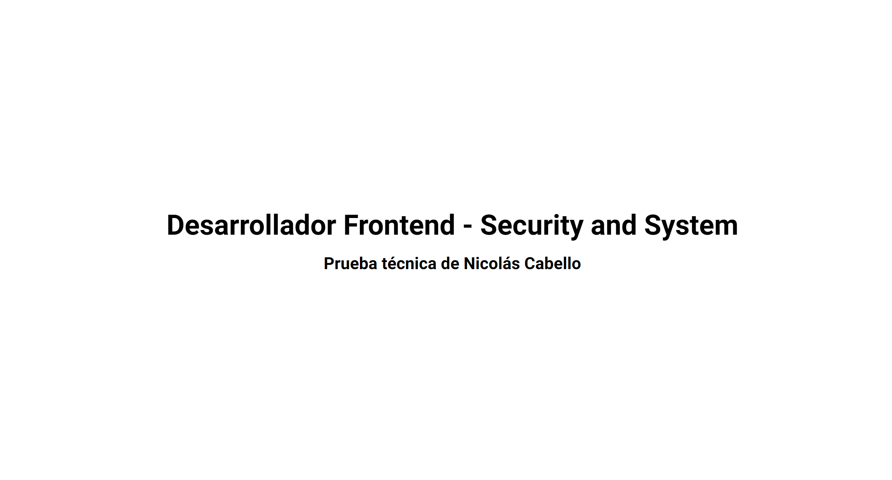
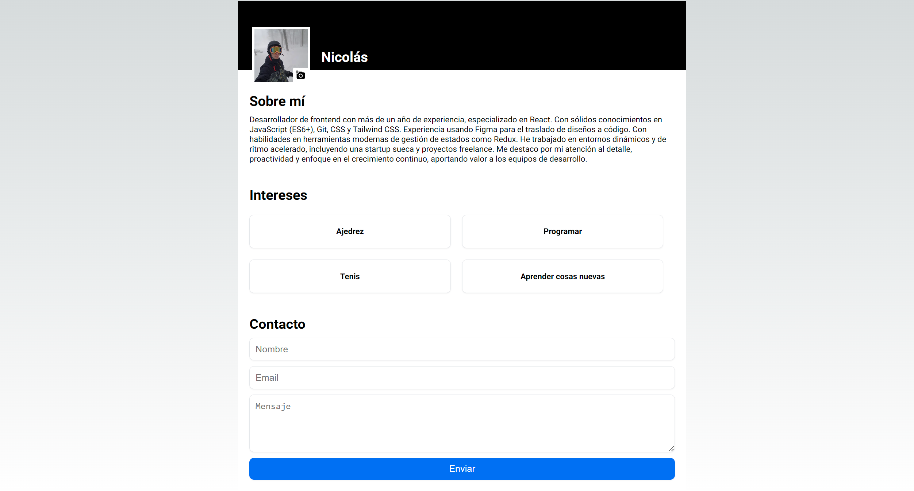

# Prueba Frontend - Security and System

Esta es la prueba técnica para el rol de Desarrollador Frontend en Security and System. Se requiere una página web responsive con distintas secciones como cabecera con imagen perfil y nombre, sobre mí, intereses y un formulario de contacto con validación de campos. La página incluye una animación de carga para la imagen de perfil y la capacidad de cambiar la imagen del perfil. Además, se muestra una página de introducción previa a la home page que se desvanece suavemente después de unos segundos.

## Características adicionales

- Pruebas unitarias
- Efectos de transición
- Carga de imagen de perfil
- Uso de CSS Modules

## Demo




## Comenzando

Primero, clona el repositorio:

```bash
git clone https://github.com/nicoc12024/prueba_security_system.git
cd prueba_security_system
```

Luego, instala las dependencias:

```bash
npm install
# o
yarn install
# o
pnpm install
# o
bun install
```

### Ejecutando el Servidor de Desarrollo

Ejecuta el servidor de desarrollo:

```bash
npm run dev
# o
yarn dev
# o
pnpm dev
# o
bun dev
```

Abrí [http://localhost:3000](http://localhost:3000) en tu navegador para ver el resultado.

Este proyecto utiliza [`next/font`](https://nextjs.org/docs/basic-features/font-optimization) para optimizar y cargar automáticamente Inter, una fuente personalizada de Google.

### Ejecutando Pruebas

Para ejecutar las pruebas del proyecto, usá el siguiente comando:

```bash
npm test
# o
yarn test
# o
pnpm test
# o
bun test
```

Asegurate de tener la configuración de pruebas necesaria y las dependencias instaladas, como `jest` y `@testing-library/react`.
